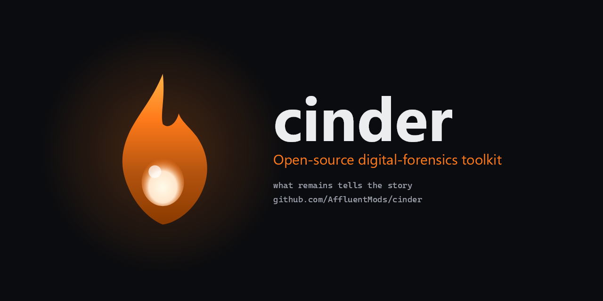

<div align="center">



# Cinder

**The open-source forensics toolkit that's both genuinely powerful and genuinely beautiful.**

*What remains tells the story.*

[](LICENSE)
[](https://github.com/AffluentMods/cinder/actions/workflows/ci.yml)
[](https://github.com/AffluentMods/cinder/actions/workflows/codeql.yml)
[](https://github.com/AffluentMods/cinder/releases)
[](https://github.com/sponsors/AffluentMods)

[**Download**](https://github.com/AffluentMods/cinder/releases) ·
[**Documentation**](docs/) ·
[**Roadmap**](ROADMAP.md) ·
[**Contributing**](CONTRIBUTING.md) ·
[**Security**](SECURITY.md)

</div>

---

## What is Cinder?

Cinder is a unified, cross-platform digital forensics workstation that
consolidates what currently requires eight separate tools — Autopsy,
FTK Imager, the Eric Zimmerman suite, Volatility, Hindsight, ExifTool,
Plaso, and WinHex — into one modern application with one UI, one case
format, and one workflow.

Built for digital forensics examiners, incident responders, security
students, and homelab tinkerers who deserve better than 1995-era UIs and
five-figure price tags. Built natively in C# .NET 10 on Avalonia 11 so it
looks and feels right on both Windows 11 and Linux.

## Status — v0.2.0, May 2026

Cinder is **pre-alpha but actively useful**. Most parsers and the core
case workflow work end-to-end against real evidence today; a handful of
heavy lifts (signed kernel drivers, Volatility memory pipeline, package
managers) are still on the roadmap.

| Phase | Status | What's in it |
|---|---|---|
| **0 — Foundation** | ✅ shipped | Avalonia shell, design system, command palette, SQLite case store, hash-chained custody log, Serilog, branding, CI |
| **1 — Hex viewer & hashing** | ✅ shipped | Memory-mapped hex viewer (opens 100 GB images instantly), inspector, MD5/SHA-1/SHA-256/BLAKE3, 60+ signature scanner |
| **1.5 — Shell & UX** | ✅ shipped | Home dashboard, per-tool help (F1), multi-case tabs, persistent recents, friendly empty states |
| **2 — Imaging & verification** | 🟡 partial | Image mount works (VHD/VHDX/ISO); E01 acquisition + signed write-blocker driver pending |
| **3 — Filesystem & carving** | ✅ shipped | NTFS / FAT / ext2-4 / ISO9660 / VHD(X) via DiscUtils; header+footer carver with 30+ signatures |
| **4 — Windows artifacts** | ✅ shipped | Registry, EVTX, Prefetch, LNK, Jumplists, Shellbags, USB/Wi-Fi history, Amcache, ShimCache, SRUM, browser history, email |
| **5 — Linux artifacts** | ✅ shipped | shell history, auth.log, syslog, cron, passwd/shadow, SSH known_hosts |
| **6 — Search, timeline, YARA** | 🟡 partial | Lucene case-wide search ✅, YARA-lite ✅, Map ✅, Communication graph ✅; super-timeline merge pending |
| **7 — Memory forensics** | ⬜ planned | Volatility 3 wrapper UI shell exists; RAM capture needs signed driver |
| **8 — Reporting & case mgmt** | ✅ shipped | Real PDF (QuestPDF) + DOCX (OpenXml) reports, custody chain view, JSON workflows |
| **9 — AI copilot** | 🟡 partial | BYOM provider selection (Ollama / LM Studio / OpenAI-compat) wired with health-check + DPAPI-encrypted keys |
| **10 — Network, mobile, cloud** | 🟡 partial | PCAP ✅, iOS backup ✅, Android adb ✅, cloud OAuth/PKCE scaffolds (token exchange pending) |

Full status with line-by-line detail: **[ROADMAP.md](ROADMAP.md)**.
Known limits with workarounds: **[LIMITATIONS.md](LIMITATIONS.md)**.

## Screenshots

> Screenshots from the v0.2.0 build. Generated against synthetic test
> data — no real case material is shown.

<!--
  Once you've launched the v0.2.0 build, drop screenshots into
  assets/screenshots/ with the filenames below and they'll appear here.
  See docs/screenshots.md for the suggested capture protocol.
-->

<div align="center">

| Home dashboard | Hex viewer |
|---|---|
|  |  |
| Recent cases, recent evidence, quick-start guide. | Memory-mapped, opens 100 GB images instantly. Inspector decodes 14 types at the caret. |

| Event Log timeline | Court-ready PDF report |
|---|---|
|  |  |
| Streams every record with timestamp, channel, EventId, user, computer. | Cover, per-section narrative, embedded exhibit cards, exhibit index. |

</div>

## Cinder vs the alternatives

| Capability | **Cinder** | Autopsy | FTK Imager | EZ Tools | Volatility |
|---|---|---|---|---|---|
| Modern native cross-platform UI | ✅ Avalonia 11 | 🟡 Java Swing | 🟡 Win32 only | ❌ separate CLIs | ❌ CLI |
| Open source | ✅ Apache-2.0 | ✅ Apache-2.0 | ❌ freeware, closed | ✅ MIT | ✅ GPL-2 |
| Hex viewer (100 GB+ images) | ✅ memory-mapped | 🟡 basic | 🟡 basic | ❌ | ❌ |
| Disk imaging (E01 / raw) | 🟡 mount only today | ✅ | ✅ | ❌ | ❌ |
| Filesystem parsers (NTFS/FAT/ext) | ✅ DiscUtils, in-process | ✅ via pytsk | ❌ | ❌ | ❌ |
| Windows artifact suite | ✅ EZ libs, in-process | ✅ ingest modules | ❌ | ✅ separate CLIs | ❌ |
| Email (.msg / .eml / .mbox) | ✅ | ✅ via plugin | ❌ | ❌ | ❌ |
| PCAP / PCAPNG | ✅ SharpPcap | 🟡 via plugin | ❌ | ❌ | ❌ |
| YARA scanning | ✅ YARA-lite | ✅ | ❌ | ❌ | ✅ |
| Full-text Lucene search | ✅ | ✅ | ❌ | ❌ | ❌ |
| Map (EXIF GPS auto-ingest) | ✅ | 🟡 | ❌ | ❌ | ❌ |
| Communication graph (email → DAG) | ✅ | ❌ | ❌ | ❌ | ❌ |
| Memory forensics | ⬜ planned | 🟡 plugin | ❌ | ❌ | ✅ canonical |
| Court-ready PDF + DOCX reports | ✅ in-process | ✅ HTML/PDF | ❌ | ❌ | ❌ |
| Local AI copilot (BYOM) | ✅ Ollama / LM Studio / OpenAI | ❌ | ❌ | ❌ | ❌ |
| Workflow DAG runner | ✅ JSON DAG + handlers | 🟡 ingest modules | ❌ | ❌ | 🟡 plugins |
| Single unified case format | ✅ SQLite + hash-chained custody | ✅ | ❌ | ❌ | ❌ |
| Telemetry | ✅ never | ✅ never | ✅ never | ✅ never | ✅ never |
| Price | Free, forever | Free, forever | Free download, closed | Free | Free |

✅ ships and works · 🟡 partial / shell-only · ❌ not provided · ⬜ planned

Where Cinder distinguishes itself: **one app instead of eight**, **modern
cross-platform native UI**, **everything in-process** (no Python venv
churn for the common Windows-artifact cases), and a **BYOM AI copilot**
that nobody else in the space ships.

Where the established tools win today: **Autopsy** has a decade-plus of
courtroom history and deeper ingest-module ecosystem; **Volatility** is
the canonical memory tool and remains the source of truth until Cinder's
Phase 7 lands; **FTK Imager** is still the friendliest single-purpose
acquisition tool on Windows.

## Install

### Today

Download the self-contained build for your platform from the
[**latest GitHub Release**](https://github.com/AffluentMods/cinder/releases/latest) —
no dependencies to install, no Python venv to manage, the runtime is
bundled.

**Windows** — `Cinder.exe`, single-file self-contained .NET 10. Double-click
to launch. Right-click → Run as administrator if you need raw-device access.

**Linux** — `cinder-linux-x64.tar.gz`. Extract and run:
```bash
tar xzf cinder-linux-x64.tar.gz
./Cinder
```

**Verify the download** against `SHA256SUMS.txt` from the release page:
```bash
sha256sum -c SHA256SUMS.txt
```

### Coming

Package-manager installs are tracked but not yet shipping:
`winget install AffluentLabs.Cinder` · `yay -S cinder` (AUR) ·
`.deb` for Debian/Ubuntu · `.rpm` for Fedora/RHEL · AppImage for any
distro.

### Code signing

Windows builds will be code-signed under the [SignPath
Foundation](https://signpath.org)'s free signing program for open-source
projects once the application is approved (in flight). Until then, Windows
SmartScreen may warn on download — verify the SHA-256 against the release
page and click "More info → Run anyway" to confirm.

## Quickstart: your first case in five minutes

1. **Launch Cinder** and click **New case** from the home dashboard.
   Pick a name and a directory; Cinder creates a SQLite-backed case store
   with a hash-chained chain-of-custody log inside it.
2. **Open evidence** — drop a disk image (`.E01`, `.dd`, `.raw`, `.vhd`,
   `.vhdx`), a registry hive (`NTUSER.DAT`, `SYSTEM`), an event log
   (`.evtx`), a PCAP, a `.msg` / `.eml` / `.mbox`, or basically anything.
   Cinder's signature scanner auto-routes the file to the right tool.
3. **Browse with the Hex viewer** (Ctrl+O) and the **Inspector** to read
   bytes, decode integers / floats / GUIDs / FILETIME at the caret.
4. **Build a Lucene index** of the whole case folder (Search tool →
   "Build index from folder…") and full-text search across every parsed
   artifact.
5. **Export a report** (Reports tool) as PDF or DOCX with cover metadata,
   per-section narrative, embedded exhibit cards, and a full exhibit
   index — court-ready, no external converters.

Press **F1** on any tool for a "what it is, when to use it, how" written
explainer. Press **Ctrl+K** anywhere to open the command palette.

## Build from source

Prerequisites: **.NET 10 SDK**, **Python 3.12** (for the sidecars that
remain), **Git**. Full setup in [CONTRIBUTING.md](CONTRIBUTING.md).

```bash
git clone https://github.com/AffluentMods/cinder.git
cd cinder
dotnet build
dotnet run --project src/Cinder.App
```

Tests:
```bash
dotnet test
```

## Permissions

Forensic tools need raw disk access.

- **Windows** — launch with Administrator privileges, or use a hardware
  write-blocker.
- **Linux** — either `sudo cinder`, or grant the capabilities once with:
  ```bash
  sudo setcap cap_sys_rawio,cap_sys_admin+ep $(which Cinder)
  ```

## Architecture

```
┌─────────────────────────────────────────────────────────────────────┐
│                 Avalonia UI 11  (cross-platform shell)              │
│         MVVM via CommunityToolkit · ReactiveUI · FluentAvalonia     │
└──────────────────┬──────────────────────────────────┬───────────────┘
                   │                                  │
   ┌───────────────▼─────────────┐    ┌───────────────▼──────────────┐
   │     Cinder.Core (.NET 10)   │    │  Cinder.AI / Search /        │
   │  case store · custody log · │    │  Reports / Workflow / Hex /  │
   │  hash service · signatures  │    │  Carving / Imaging / Plugins │
   └──────┬─────────┬────────────┘    └──────────────────────────────┘
          │         │
   ┌──────▼─────┐ ┌─▼─────────────────┐    ┌─────────────────────────┐
   │ SQLite     │ │ Cinder.Native     │    │  Python 3.12 sidecars   │
   │ case DB    │ │ ↓ Windows / Linux │ ←→ │  pytsk3, libpff, vol3,  │
   └────────────┘ │ platform code     │    │  the long-tail formats  │
                  └───────────────────┘    └─────────────────────────┘
```

Detail in [docs/plan.md](docs/plan.md) §2 (Architecture).

## Why open source?

When defense counsel can audit the tool that produced your evidence,
methodology challenges are easier to defeat. Open-source forensic tools
(The Sleuth Kit, Volatility, Plaso) hold their ground in courtrooms
against five-figure commercial alternatives for exactly this reason.
Cinder follows that posture: every parser is reviewable, every algorithm
is auditable, every report is reproducible from the case bundle.

## Security

Cinder reads attacker-controlled bytes by definition. The threat model,
the v0.1.0 hardening pass (command injection, decompression bombs,
plugin trust gates, key zeroization), and the responsible-disclosure
process all live in **[SECURITY.md](SECURITY.md)**. Report
vulnerabilities privately via [GitHub Security
Advisories](https://github.com/AffluentMods/cinder/security/advisories/new) —
**never as a public issue.**

## Telemetry

**None.** Cinder does not phone home. Ever. No analytics, no crash
reporting that uploads to a server, no usage pings beyond a public
GitHub API call (for update checks) that you can disable. Your evidence
stays on your machine.

## Contributing

Contributions are welcomed and encouraged — every parser, every artifact,
every UI polish helps. Read **[CONTRIBUTING.md](CONTRIBUTING.md)** for the
dev setup, coding conventions, and PR workflow. Issues tagged
[`good first issue`](https://github.com/AffluentMods/cinder/labels/good%20first%20issue)
are intentionally scoped for newcomers.

This project adheres to the [Contributor Covenant 2.1
Code of Conduct](CODE_OF_CONDUCT.md). Be excellent to each other.

## Sponsor

Cinder is free and will stay free. If it saves you time,
[sponsor on GitHub](https://github.com/sponsors/AffluentMods) or
contribute a parser. Funds go toward code-signing certificates, test
hardware, and domain renewals — not salaries.

## License

[Apache License 2.0](LICENSE) — use it commercially, fork it, embed it,
modify it. Just keep the copyright notice and don't sue us over patents.

## Acknowledgments

Cinder stands on the shoulders of giants in the digital-forensics
community, both open-source projects and individuals:

- [The Sleuth Kit](https://www.sleuthkit.org/) and Brian Carrier
- [Autopsy](https://www.autopsy.com/) and Basis Technology
- [Volatility Framework](https://volatilityfoundation.org/) and the
  Volatility Foundation
- [Eric Zimmerman's tools](https://ericzimmerman.github.io/) — `Registry`,
  `evtx`, `Lnk`, `Prefetch`, `JumpList`
- [Plaso / log2timeline](https://plaso.readthedocs.io/)
- [DiscUtils](https://github.com/LTRData/DiscUtils),
  [PdfPig](https://github.com/UglyToad/PdfPig),
  [QuestPDF](https://www.questpdf.com/),
  [SharpPcap](https://github.com/dotpcap/sharppcap),
  [MetadataExtractor](https://github.com/drewnoakes/metadata-extractor-dotnet),
  [MsgReader](https://github.com/Sicos1977/MSGReader),
  [Lucene.NET](https://lucenenet.apache.org/), and every other library
  listed in [`Directory.Packages.props`](Directory.Packages.props)
- [Avalonia UI](https://avaloniaui.net/) and the Avalonia community

Built by [Affluent Labs](https://github.com/AffluentMods).
